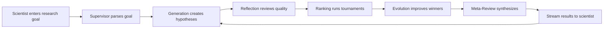

# Enhanced CoScientist System Implementation Guide

## Part 0 · System Overview

### What is the AI Co-Scientist?

The AI Co-Scientist is a multi-agent system built on Claude that assists scientists in generating novel research hypotheses. It's designed to augment human scientific discovery by:

1. **Searching and synthesizing scientific literature** across multiple databases
2. **Generating novel hypotheses** through iterative reasoning and debate
3. **Evaluating hypotheses** for novelty, feasibility, impact, and testability
4. **Evolving and refining** ideas through tournament-based selection
5. **Providing experimental protocols** and identifying key research contacts

### Core Architecture

The system uses **OpenAI's Swarm framework** to orchestrate specialized AI agents:
- **Supervisor Agent**: Orchestrates the entire process
- **Generation Agent**: Creates hypotheses using literature and reasoning
- **Reflection Agent**: Reviews hypotheses for quality and novelty
- **Ranking Agent**: Runs tournaments to identify best hypotheses
- **Evolution Agent**: Improves existing hypotheses
- **Proximity Agent**: Clusters similar ideas
- **Meta-Review Agent**: Synthesizes feedback for continuous improvement

### Key Features

1. **Real-time Streaming**: Users see AI reasoning and hypothesis generation character-by-character
2. **Distributed Processing**: Uses Redis/Celery for scalable, fault-tolerant execution
3. **Multi-dimensional Evaluation**: Hypotheses scored on novelty (30%), impact (30%), feasibility (20%), testability (20%)
4. **Tool Integration**: Connects to scientific databases (PubChem, UniProt, etc.) and computational tools (AlphaFold)
5. **Expert-in-the-Loop**: Scientists can provide feedback, add their own hypotheses, and guide the system

### Technical Stack

- **Backend**: Python 3.11, FastAPI, OpenAI Swarm, Redis, Celery
- **Database**: PostgreSQL (structured data) + Chroma (vector embeddings)
- **Frontend**: React 18, TypeScript, WebSocket streaming
- **LLMs**: Claude Sonnet 3.7/4 with OpenAI embeddings
- **Deployment**: Docker, with optional Kubernetes support

### Use Cases

1. **Drug Repurposing**: Identify existing drugs for new therapeutic applications
2. **Target Discovery**: Find novel biological targets for diseases
3. **Mechanism Elucidation**: Explain biological phenomena and antimicrobial resistance
4. **Basic Research**: Generate hypotheses for any scientific question

### How It Works



The system continuously improves through feedback loops, with each iteration producing higher-quality hypotheses as measured by the multi-dimensional scoring system.

## Part A · Complete Prompt Catalogue

Location in repo: backend/prompts/

### 1. Supervisor Agent

```
SUPERVISOR_PROMPT = """
You are the Supervisor agent orchestrating the AI co‑scientist system. Your responsibilities:
- Parse research goals into research‑plan configurations
- Assign tasks to specialised agents based on current system state
- Monitor progress and allocate computational resources
- Decide when to trigger tournaments, reviews, or hypothesis generation
- Maintain system statistics and decide on terminal states
Current system state: {system_state}
Research goal: {research_goal}
Task queue: {task_queue}
Decide which agent to activate next and with what parameters.
"""
```

### 2. Generation Agent

#### 2.a Literature‑Review Mode

```
GENERATION_PROMPTS["literature_review"] = """
You are an expert tasked with formulating a novel and robust hypothesis to address the following objective.
Describe the proposed hypothesis in detail, including specific entities, mechanisms, and anticipated outcomes.
This description is intended for an audience of domain experts.
You have conducted a thorough review of relevant literature and developed a logical framework for addressing
the objective. The articles consulted, along with your analytical reasoning, are provided below.
Goal: {goal}
Criteria for a strong hypothesis: {preferences}
Existing hypothesis (if applicable): {source_hypothesis}
{instructions}
Literature review and analytical rationale (chronologically ordered, beginning with the most recent analysis):
{articles_with_reasoning}
Proposed hypothesis (detailed description for domain experts):
"""
```

#### 2.b Simulated‑Debate Mode

```
GENERATION_PROMPTS["scientific_debate"] = """
You are an expert participating in a collaborative discourse concerning the generation of a {idea_attributes}
hypothesis. You will engage in a simulated discussion with other experts.
The overarching objective of this discourse is to collaboratively develop a novel and robust {idea_attributes}
hypothesis.
Goal: {goal}
Criteria for a high‑quality hypothesis: {preferences}
Instructions: {instructions}
Review Overview: {reviews_overview}
Procedure:
Initial contribution (if initiating the discussion):
- Propose three distinct {idea_attributes} hypotheses.
Subsequent contributions (continuing the discussion):
* Pose clarifying questions if ambiguities or uncertainties arise.
* Critically evaluate the hypotheses proposed thus far, addressing the following aspects:
- Adherence to {idea_attributes} criteria.
- Utility and practicality.
- Level of detail and specificity.
* Identify any weaknesses or potential limitations.
* Propose concrete improvements and refinements to address identified weaknesses.
* Conclude your response with a refined iteration of the hypothesis.
General guidelines:
* Exhibit boldness and creativity in your contributions.
* Maintain a helpful and collaborative approach.
* Prioritise the generation of a high‑quality {idea_attributes} hypothesis.
Termination condition:
When sufficient discussion has transpired (typically 3‑5 conversational turns, with a maximum of 10 turns) and
all relevant questions and points have been thoroughly addressed and clarified, conclude the process by
writing **HYPOTHESIS** followed by a concise and self‑contained exposition of the final idea.
#BEGIN TRANSCRIPT#
{transcript}
#END TRANSCRIPT#
Your Turn:
"""
```

### 3. Reflection Agent

```
REFLECTION_PROMPT = """
You are an expert in scientific hypothesis evaluation. Analyse the relationship between a provided hypothesis
and observations from a scientific article.
Determine whether the hypothesis provides a novel causal explanation for the observations, or if they
contradict it.
Instructions:
1. Observation extraction – list relevant observations from the article.
2. Causal analysis (individual) – for each observation:
a. State if its cause is already established.
b. Assess if the hypothesis could be a causal factor (hypothesis => observation) starting with:
"would we see this observation if the hypothesis was true:"
c. Indicate novelty ("missing piece" vs "not a missing piece").
3. Causal analysis (summary) – start with:
"would we see some of the observations if the hypothesis was true:"
4. Disproof analysis – start with:
"does some observations disprove the hypothesis:"
5. Conclusion – end with
"hypothesis: <already explained | other explanations more likely | missing piece | neutral | disproved>".
Article:
{article}
Hypothesis:
{hypothesis}
Response:
"""
```

### 4. Ranking Agent

#### 4.a Single‑Turn Comparison

```
RANKING_PROMPTS["comparison"] = """
You are an expert evaluator tasked with comparing two hypotheses.
Provide a concise rationale and finish by writing "better hypothesis: <1 or 2>".
Goal: {goal}
Evaluation criteria: {preferences}
Considerations: {notes}
Hypothesis 1:
{hypothesis_1}
Hypothesis 2:
{hypothesis_2}
Review of hypothesis 1:
{review_1}
Review of hypothesis 2:
{review_2}
Reasoning and conclusion:
"""
```

#### 4.b Simulated‑Debate Tournament

```
RANKING_PROMPTS["simulated_debate"] = """
You are an expert panel simulating a structured debate to decide which hypothesis is superior.
Goal: {goal}
Criteria for hypothesis superiority: {preferences}
Hypothesis 1: {hypothesis_1}
Hypothesis 2: {hypothesis_2}
Initial review 1: {review1}
Initial review 2: {review_2}
Debate procedure (3‑5 turns, max 10):
* Begin with a concise summary of both hypotheses and reviews.
* Pose clarifying questions.
* Critically evaluate each hypothesis on:
- Correctness / validity
- Utility and practicality
- Detail and specificity
- Novelty
- Desirability
* Identify weaknesses and propose improvements.
When complete, state rationale and finish with **better idea: 1** or **better idea: 2**.
Additional notes: {notes}
"""
```

### 5. Evolution Agent

```
EVOLUTION_PROMPTS["feasibility_improvement"] = """
You are an expert in scientific research and technological feasibility analysis.
Refine the conceptual idea to enhance practical implementability with contemporary technology, retaining
novelty and coherence.
Goal: {goal}
Guidelines:
1. Introductory overview of the domain.
2. Concise synopsis of recent pertinent research.
3. Argument for how current tech facilitates the concept.
4. CORE CONTRIBUTION – detailed, technologically viable alternative emphasising simplicity.
Evaluation Criteria: {preferences}
Original Concept: {hypothesis}
Response:
"""

EVOLUTION_PROMPTS["out_of_box_thinking"] = """
You are an expert researcher generating a novel, singular hypothesis inspired by analogous elements from
provided concepts.
Goal: {goal}
Instructions:
1. Introduce the domain.
2. Summarise recent findings.
3. Identify promising exploratory avenues.
4. CORE HYPOTHESIS – detailed, original, specific, leveraging analogy rather than direct replication.
Criteria for a robust hypothesis: {preferences}
Inspiration list: {hypotheses}
Response:
"""
```

### 6. Proximity Agent

```
PROXIMITY_PROMPT = """
Calculate semantic similarity between research hypotheses.
Consider:
- Core mechanisms and concepts
- Target pathways / systems
- Experimental approaches
- Expected outcomes
Hypotheses list: {hypotheses}
Output: similarity matrix + clustering suggestions.
"""
```

### 7. Meta‑Review Agent

```
METAREVIEW_PROMPT = """
You are an expert in scientific research synthesis.
Generate a comprehensive meta‑review of the following reviews.
Research goal: {goal}
Preferences: {preferences}
Additional instructions: {instructions}
Reviews for analysis:
{reviews}
Instructions:
* Identify recurring critique points and systemic issues.
* Produce actionable insights to guide future hypothesis generation and review.
* Do NOT grade individual reviews; synthesise meta‑level feedback.
Response:
"""
```

## Part B · System Architecture & Data‑Flow

### 1. High‑Level Design

The system mirrors, at a high-level, the Google DeepMind AI Co‑Scientist pipeline

```
Scientist (natural‑language goal)
│
▼
┌─────────────────────────────────────────────────┐
│ SUPERVISOR AGENT │
│ • parses goal & statistics │
│ • schedules specialised agents │
└─────────────────────────────────────────────────┘
│ (tasks)
▼
┌────────── Multi‑Agent Loop ──────────┐
│ 1 Generation → produce hypotheses │
│ 2 Reflection → initial / full │
│ 3 Ranking → tournaments (Enhanced) │
│ 4 Evolution → new / refined │
│ 5 Proximity → similarity graph │
│ 6 Meta‑Review → system‑wide crit │
└──────────────────────────────────────┘
│
▼
Context Memory (PostgreSQL + Chroma) [**Yet to be Build**]
│
▼
Research Overview / Final Results
│
▼
Scientist UI
```

● Front‑end (React + WS) streams tokens from the active agent.
● Back‑end (FastAPI) hosts the Supervisor and agents with **enhanced async processing using Redis task queue**.
● Claude Sonnet 4.0 drives all reasoning steps with **dynamic prompt optimization**; OpenAI embeddings create vectors for the Proximity agent.

### 2. Detailed Data‑Flow

```
flowchart TD
subgraph UI
U1[User<br>research goal]
U2[Simple / Advanced<br>mode switch]
end
U1 -->|JSON payload| API
API -->|enqueue| S(Supervisor)
subgraph CorePipeline
direction LR
G(Generation) --> Rf(Reflection)
Rf --> Rt(Ranking<br>Enhanced)
Rt --> Ev(Evolution)
Ev --> Px(Proximity)
Px --> MR(Meta‑Review)
MR --> Rt
MR --> G
end
S -->|spawn tasks via Redis| G
Rt -->|Multi-dimensional scores| DB[(Postgres)]
Px -->|similarity vectors| VDB[(Chroma)]
Ev --> S
S -->|write stats| DB
DB --> S
MR --> S
S -->|stream results| API
API -->|WebSocket| U2
```

Arrows represent predominant data direction; the Meta‑Review agent feeds back into Generation and Reflection, closing the self‑improvement loop described in the paper.

### 3. Key Architectural Parallels to the Paper

| Paper Component | Implementation Choice | Source |
|-----------------|----------------------|---------|
| Multi‑agent specialisation | One Python class per agent, prompt‑driven with **AdaptivePromptManager**, orchestrated by Supervisor | |
| Tournament with Elo ratings | **Enhanced multi-dimensional evaluation** storing hypothesis_id ↔ composite_score in Postgres | |
| Self‑debate & self‑critique | Generation's scientific‑debate mode + Ranking's simulated‑debate mode | |
| Context memory | Toggle‑able Postgres + Chroma backing; mirrors "Memory" in Google Co-scientist paper | |
| Tool use (AlphaFold, etc.) | Stub endpoints under services/stubs/ ready for integration | Implementation manual |
| Scientist‑in‑the‑loop | Advanced mode exposes step controls & lets user inject hypotheses / reviews | README system overview |

### 4. Operational Modes

| Mode | UX | Agents triggered |
|------|-----|-----------------|
| Simple / Auto‑run | One click; Supervisor cycles through full loop until convergence or max_iterations | All six |
| Advanced / Step | User advances pipeline stage‑by‑stage; can edit prompts or inject custom reviews | User‑selected subset |

### 5. Persistence & Reproducibility

● Every hypothesis, review, debate transcript, and meta‑review is stored with a SHA‑256 content hash.
● IMPLEMENTATION_STATUS.md tracks completed features; CI fails if coverage drops.
● Observability (OpenTelemetry) and Auth (JWT) are wired but disabled by default.

## 6. Global Overview

| Layer | Tech | Purpose |
|-------|------|---------|
| LLM & Embedding | Claude Sonnet 3.7/4.0 (LOD 4.0) · OpenAI text-embedding‑3‑large | Core reasoning · vectorisation |
| Backend | Python 3.11 · FastAPI · **Redis + Celery** · Async workers | API, orchestration, **enhanced task queue**, WebSocket streams |
| Persistence | PostgreSQL 15 · Chroma 0.4 | Structured context + vector search (both opt‑in via ENABLE_PERSISTENCE=true) |
| Frontend | React 18 · TypeScript · Vite · Tailwind CSS · WebSocket | Dual‑mode UI (Simple / Advanced) |
| Container & Ops | Docker 24 · docker‑compose; optional OpenTelemetry, Prometheus + Grafana (all disabled by default) | |
| Auth (optional) | FastAPI‑Users · JWT (HS256) · Email magic‑link | Switch with AUTH_ENABLED=true |
| Licence | MIT | |

## 1 Repository Skeleton

```
co‑scientist/
│
├── backend/
│ ├── main.py # FastAPI entry‑point
│ ├── api/ # REST & WS routers
│ ├── agents/ # Supervisor + specialised agents
│ │ ├── prompt_optimizer.py # NEW: AdaptivePromptManager
│ │ └── tournament.py # NEW: EnhancedTournament
│ ├── prompts/ # ↳ *.prompt (see §4)
│ ├── services/
│ │ ├── llm.py # Claude 4.0 wrapper
│ │ ├── embeddings.py # OpenAI embedding helper
│ │ ├── literature.py # NEW: SmartLiteratureSearch
│ │ ├── memory.py # Postgres + Chroma adapter
│ │ ├── task_queue.py # NEW: Redis/Celery integration
│ │ └── stubs/ # alphafold.py · chembl_docking.py
│ ├── db/ # SQLModel models & migrations
│ ├── core/ # orchestration, schemas, config
│ ├── tests/ # PyTest unit & integration tests
│ └── Dockerfile
│
├── frontend/
│ ├── src/ … # React codebase – structure matches UI spec
│ └── Dockerfile
│
├── ops/
│ ├── docker‑compose.yml # full dev stack
│ ├── docker‑compose.prod.yml # prod override (nginx, replicas, OTEL)
│ └── k8s/ (optional helm charts)
│
├── docs/
│ ├── architecture.md
│ ├── api_reference.md
│ ├── test_matrix.md
│ └── prompts_catalogue.md
│
├── CHANGELOG.md # semantic‑version log
├── IMPLEMENTATION_STATUS.md # running checklist (see §10)
├── .env.sample
└── LICENSE
```

## 2 Environment & Secrets

```bash
# .env.sample
# --- mandatory ---
ANTHROPIC_API_KEY=
OPENAI_API_KEY=
SERPER_API_KEY=
SEMANTIC_SCHOLAR_API_KEY=
PERPLEXITY_API_KEY=

# --- optional toggles ---
ENABLE_PERSISTENCE=false
AUTH_ENABLED=false
OTEL_ENABLED=false
EMBEDDING_MODEL=text-embedding-3-large
POSTGRES_URL=postgresql://cs:cs@postgres:5432/coscientist
CHROMA_PATH=/chroma

# --- NEW: enhanced configuration ---
REDIS_URL=redis://redis:6379/0
MAX_WORKERS_PER_AGENT=4
HYPOTHESIS_CACHE_TTL=3600
TOURNAMENT_MIN_COMPARISONS=10
EVOLUTION_MUTATION_RATE=0.2
LITERATURE_SEARCH_DEPTH=3
RESULT_CONFIDENCE_THRESHOLD=0.7
RETRY_MAX_ATTEMPTS=3
RETRY_BACKOFF_SECONDS=2
CIRCUIT_BREAKER_THRESHOLD=5
CIRCUIT_BREAKER_TIMEOUT=60
```

Tip: Supply ENABLE_PERSISTENCE=true to bring Postgres + Chroma containers online; otherwise the system falls back to in‑memory stores.

## 3 Docker‑Compose (dev stack)

```yaml
version: '3.9'
services:
  backend:
    build: ./backend
    env_file: .env
    ports: ["8000:8000"]
    depends_on: [postgres, chroma, redis]
    deploy:
      resources:
        limits:
          cpus: '4'
          memory: 16G
    environment:
      - WORKER_PROCESSES=8

  frontend:
    build: ./frontend
    env_file: .env
    ports: ["5173:80"]

  postgres:
    image: postgres:15
    environment:
      POSTGRES_USER: cs
      POSTGRES_PASSWORD: cs
      POSTGRES_DB: coscientist
    volumes: ["pgdata:/var/lib/postgresql/data"]
    profiles: ["persistence"]

  chroma:
    image: chromadb/chroma:0.4
    volumes: ["chroma:/chroma"]
    profiles: ["persistence"]

  redis:
    image: redis:7-alpine
    volumes: ["redis_data:/data"]
    command: redis-server --appendonly yes

  celery_worker:
    build: ./backend
    env_file: .env
    command: celery -A backend.services.task_queue worker --loglevel=info
    depends_on: [redis]
    deploy:
      replicas: 2

  celery_beat:
    build: ./backend
    env_file: .env
    command: celery -A backend.services.task_queue beat --loglevel=info
    depends_on: [redis]

  otel:
    image: otel/opentelemetry‑collector:latest
    profiles: ["observability"]

volumes: 
  pgdata: {}
  chroma: {}
  redis_data: {}
```

The wrapper script ops/dev_up.sh reads .env and starts services with the proper profiles.

## 4 Prompt Catalogue

All templates live in backend/prompts/ and are loaded at runtime; names are baked into config so no code changes are needed. **NEW: Prompts are now dynamically optimized via AdaptivePromptManager.**

| File | Used by | Short description |
|------|---------|-------------------|
| generation.prompt | GenerationAgent | Literature exploration, debate loop starter |
| reflection.prompt | ReflectionAgent | Two‑stage review: initial & full |
| ranking.prompt | RankingAgent | **Enhanced multi-dimensional** tournament orchestration |
| evolution.prompt | EvolutionAgent | Four refinement strategies |
| meta_review.prompt | MetaReviewAgent | Synthesise feedback & overview |
| proximity.prompt | ProximityAgent | Clustering instruction |